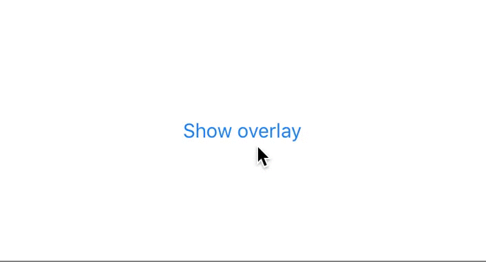

# OverlayViewController



A simple drop-in protocol encapsulating presentation and dismiss logic for child view controller. Read relevant article: [https://andreygordeev.com/2017/04/18/overlay-view-controller-protocols-swift/](https://andreygordeev.com/2017/04/18/overlay-view-controller-protocols-swift/). 

Written on Swift.

## Usage

### Parent view controller

Make the parent view controller conforming to `OverlayHost` protocol and call `showOverlay(_:)` method when needed:

```swift
class ViewController: UIViewController, OverlayHost {
    @IBAction func showOverlayButtonPressed() {
        showOverlay(type: MessageViewController.self, fromStoryboardWithName: "Main")
    }
}
```

### Overlay view controller

Make the parent view controller conforming to `OverlayViewController` protocol and call `dismissOverlay()` method when you want to dismiss the overlay:

```swift
class MessageViewController: UIViewController, OverlayViewController {
    let overlaySize: CGSize? = CGSize(width: UIScreen.main.bounds.width * 0.8, height: 120.0)
    @IBAction func closeButtonPressed() {
        dismissOverlay()
    }
}
```

## Author

[Andrey Gordeev](https//andreygordeev.com)

## License

This project is under MIT license. For more information, see `LICENSE` file.
